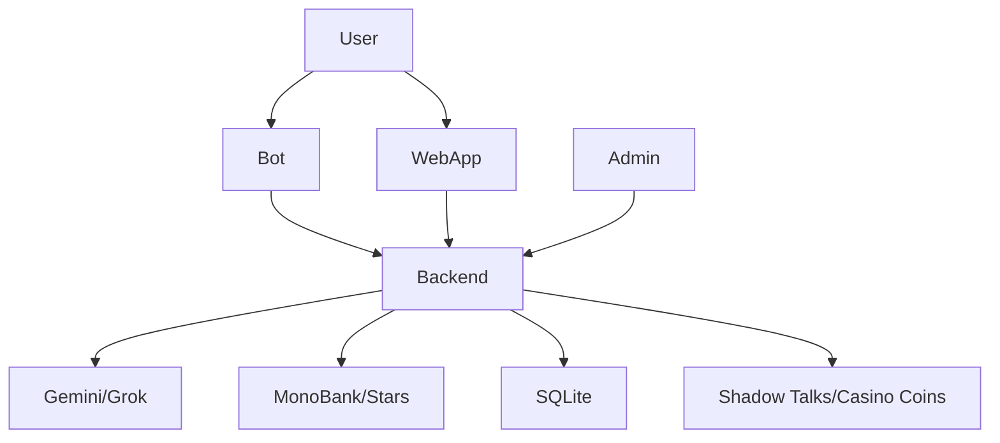

# QuanticX Monorepo

QuanticX is a modular Telegram + WebApp ecosystem with FastAPI backend, Svelte frontends, MonoBank payments, and dual-currency economy (Shadow Talks and Casino Coins).

## Monorepo Structure
```
quanticx/
├── bot/
│   ├── main.py
│   └── handlers/
├── backend/
│   ├── main.py
│   ├── models/
│   ├── routers/
│   └── services/
├── webapp/
│   ├── src/
│   └── svelte.config.js
├── admin/
│   ├── src/
│   └── svelte.config.js
├── common/
├── .env
├── .env.example
├── README.md
└── package.json
```

## Architecture


## Quickstart
- Copy `.env.example` to `.env` and fill keys
- Python 3.12, Node 20+
- Install backend deps: `python -m venv .venv && source .venv/bin/activate && pip install -U pip`
- Frontends: `npm i` at root, then `npm run dev:webapp` or `npm run dev:admin`

## Notes
- All APIs are async-first, secured with JWT and rate-limiting
- Payments via MonoBank SDK and Telegram Stars
- AI via Gemini/Grok (env: `GEMINI_API_KEY`, `GROK_API_KEY`)
